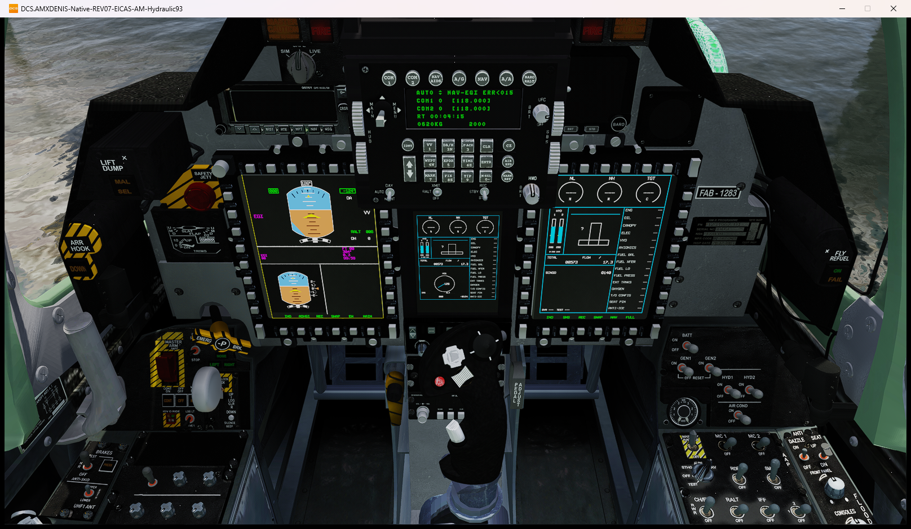
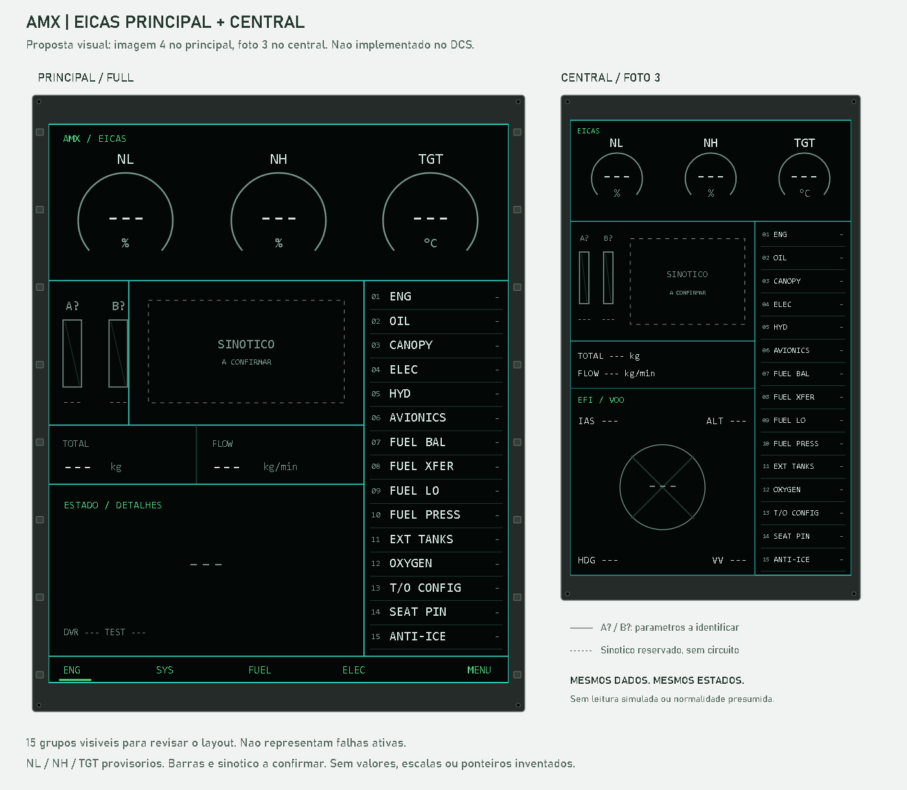
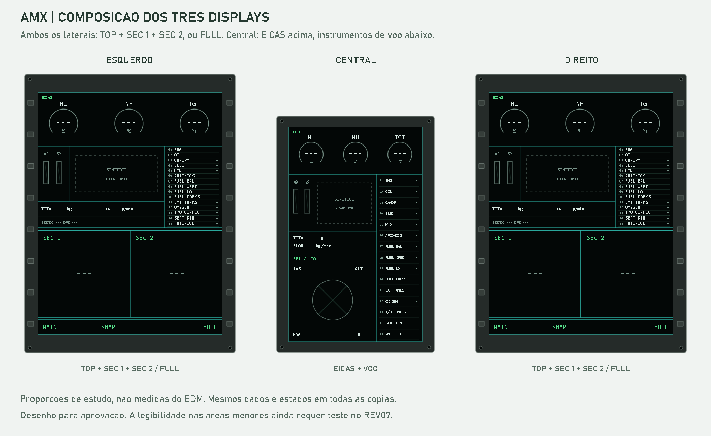

# EICAS AMX: layout aprovado, barras hidraulicas implementadas

Em 18/09/2026 o usuario respondeu "aprovado porem" e acrescentou recortes do
sinotico, reafirmando a incerteza dos pequenos textos e parametros. O aceite
foi aplicado ao layout, incluindo EICAS acima dos instrumentos de voo no
central. Nao constitui confirmacao de sensores, limites, detectores, significado
do sinotico ou aprovacao operacional completa.

Depois do cruzamento com o manual analogico, o usuario autorizou a traducao do
indicador hidraulico duplo para as duas barras digitais. Esse aceite e uma
decisao de projeto do mod; nao afirma que as fotografias modernas identificam
as barras nem amplia a aprovacao para os demais campos.

## Atualizacao Da Dinamica Hidraulica

Posteriormente, o usuario autorizou um modelo de projeto explicitamente nao
calibrado. O adaptador agora usa dois estados de pressao independentes, carga
e descarga graduais, falhas e demanda por movimento observado. Parametros e
hipoteses estao no [plano R08](PLANO_RECUPERACAO.md#r08---hidraulica).
As constantes de tempo e consumo sao escolhas do mod, nao curvas medidas do AMX.

As [provas CA/CB](Evidence/Operational-REV07/hydraulic-dynamics-results.json)
repetiram pressurizacao, falha isolada/total e recuperacao no DCS; CB
tambem confirmou descarga apos desligar. A prova de demanda por aerofreio
falhou por ausencia de movimento nativo, inclusive com comando direto. Assim,
o modelo e parcial: `CALIBRATED=0`, `CONSUMERS_COMPLETE=0`, R08 em 6/10 e meta
7 ainda aberta. Nao foi alterada a geometria, o SFM ou a disposicao dos visores.
As capturas e resultados 0/206 bar abaixo sao historicos e nao foram regravados.

## Resultado Implementado

Implementado somente no adaptador AMXDENIS e em candidatos isolados; nao foi
instalado no perfil normal. Candidato do ultimo ensaio de layout/hidraulica:
`AMXT_M-REV07-EICAS-AM-Hydraulic93`, BuildId
`DD49487E8EAE8925598934B9403087D15171CDCFD3A4432EF6341D6A70B03C6D`.
O projeto F-5, as referencias importadas, os modelos, exterior e SFM nao foram
editados. Os quatro nomes de aeronave e a identidade original permanecem.



Esta imagem e do DCS, nao da previa HTML. Mostra HYD 1 e HYD 2 em 206 bar
modelados. A [captura de baixa pressao](Evidence/EICAS-REV07/native-hydraulic-low.png)
mostra as duas barras em zero e o grupo HYD ativo. Essas imagens demonstram a
apresentacao e a transicao do modelo simplificado; nao calibram a hidraulica
fisica do AMX.

- Principal, central e areas divididas usam o mesmo renderer e os mesmos
  quinze grupos. As selecoes FULL/Top/Left/Right existentes foram preservadas.
- NL/NH/TGT continuam sem fontes validas: circulares com `---`, sem ponteiros,
  ticks numericos, faixas normais ou limites inventados. RPM/TIT genericos nao
  foram relabelados. A ordem visual provisoria nao confirma a instrumentacao.
- Duas barras HYD 1/2 usam escala documental de 0 a 300 bar e marca de baixa
  pressao em 93 bar. Os valores vem dos canais modelados existentes; a escolha
  traduz o indicador analogico duplo e nao identifica as barras das fotografias.
- TOTAL/FLOW usam as fontes nativas existentes. Indicacoes HYD 1/2 em bar
  permanecem explicitamente modeladas, nao medidas/calibradas de pressao real.
- Quinze posicoes nao significam quinze detectores. Somente CANOPY, ELEC e
  HYD agregam causas parciais existentes. Os demais grupos ficam indisponiveis;
  `COMPLETE=0` impede tratar cobertura parcial como sistema integralmente saudavel.
- Cada origem e preservada. ACK nao apaga causas; perda de validade conserva
  a ultima causa com `?`; o grupo limpa somente apos todas as origens conhecidas
  serem confirmadas como resolvidas. Maior severidade ativa governa o grupo.
- BINGO foi mantido separado de FUEL LO, visivel tambem no central. DVR/testes
  nao foram colocados nas quinze posicoes. Nao ha mensagem ficticia de normalidade.

Codigo: [eicas_groups.lua](../../Avionics/AMXDENIS/Scripts/Host/eicas_groups.lua),
[host_eicas_layout.lua](../../Avionics/AMXDENIS/Scripts/Indicator/host_eicas_layout.lua),
[CMFD_EICAS.lua](../../Avionics/AMXDENIS/Scripts/CMFD/Indicator/CMFD_EICAS.lua) e
[EFI.lua](../../Avionics/AMXDENIS/Scripts/EFI/Indicator/EFI.lua).
A atualizacao dos grupos e chamada pelo alarme real via
[patches.lua](../../Avionics/AMXDENIS/patches.lua).

Evidencias: [indice](Evidence/EICAS-REV07/index.json),
[resultados nativos](Evidence/EICAS-REV07/native-results.json) e
[ciclo hidraulico](Evidence/EICAS-REV07/hydraulic-results.json). AI preserva a primeira tentativa com recorte
do central; AJ corrige o enquadramento e exercita causas/controles; AK corrige
a ausencia inicial de BINGO no central; AM implementa e exercita as barras
HYD 1/2. As evidencias anteriores nao foram substituidas.

CI: 43 guardas de integracao, 36 de textura, 27 de viewer, 12 de ancoras,
8+14 testes Python, 353 do observador, 221 arquivos Lua, 527 verificacoes de
registro, 1777 de runtime e 22743 de indicadores em 69 paginas. Na prova nativa,
uma origem GEN 2 continuou ativa apos recuperar GEN 1, e a ultima recuperacao
limpou o grupo. ACK, perda de validade e energia foram observados; comparacao
de pixels em interiores fixos confirmou telas apagadas e restauradas.

No run AM, tres amostras confirmaram 206/206 bar. O corte explicito do motor
produziu 0/0 bar, `HYD 1 / HYD 2`, grupo ativo e os dois displays ainda ligados.
A repartida recuperou 206/206 bar e limpou o grupo. Regioes fixas das barras
mudaram no MFD direito e no central. O observador registrou zero ERROR; duas
tentativas de camera rejeitadas foram preservadas. O dcs.log manteve 159 erros
herdados, sem access violation, erro de missao, LuaDofile ou erro dos arquivos
EICAS/hidraulica alterados.

Limites: texto dos recortes inferiores e pequeno; sua selecao/renderizacao foi
observada, mas legibilidade completa nesses recortes nao esta aprovada. Uma
vista do MFD esquerdo tem oclusao fisica pelo ICP, nao corrigida alterando EDM.
Nao ha aprovacao de todos os 105 comandos, das 34 zonas, HOTAS fisico, VR,
radio, sensores ou emprego integrado. Os testes novos de COM1/COM2 por mouse
nao receberam comandos; os resultados negativos foram preservados.
As quatro sessoes privadas terminaram com integridade, 84 arquivos originais e
93 arquivos protegidos conferidos sem mudanca, nenhuma credencial temporaria
restante. Logs ainda contem erros herdados/de recursos; nao sao logs limpos.

## Comparacao Tecnica Com F-5EM

Continuidade de 18/09: o
[inventario nativo e os ensaios de controles](Evidence/Operational-REV07/mechanisms-followup.json)
foram cruzados com o manual AMX-T e com o projeto F-5EM atual, somente leitura.
O candidato BB sem alteracoes experimentais de descritor, BuildId
`777D2B2B3C7DDFCC577A3E16DC597EC6FAD245D73A3F923E0ABCEC99321639DF`, conserva
o layout AM e acrescenta diagnostico passivo de capacidades. Nao implementa
novos sensores fisicos. O ultimo ensaio hidraulico de layout continua sendo AM.

O EICAS do F-5EM consultado tem o mesmo SHA256 da
[referencia congelada](../../Avionics/Reference/AMX-A1M/Avionics/F5EM/Cockpit/Scripts/CMFD/Device/eicas.lua):
`266AEA33B7B088A56073FEC2A90C5F01C35B166447E5E0CB047B061CA0FE673B`.
A API de alarmes tambem coincide, mas o arquivo de implementacao de alarmes
atual difere da copia congelada; nao houve sincronizacao ou importacao cega.
O F-5EM registra o backend nativo `F5E`; o AMX continua SFM, sem esse backend.

| Canal | Manual AMX-T | Implementacao F-5EM consultada | Decisao no AMX |
| --- | --- | --- | --- |
| NL/NH | PDF 40: eixos LP/HP independentes de um motor | E1/E2 usam RPM de motores esquerdo/direito; o codigo multiplica a leitura por 100 | Dois motores nao equivalem a dois eixos. RPM generico observado no AMX ja esta em percentual; nao copiar o fator nem usar o canal direito como NH |
| TGT | PDF 40: sinal compensado de T6/T1 em graus C | EGT e reconstruida dos argumentos de cockpit 12/14 com curvas especificas | A temperatura generica antes da turbina nao comprova TGT; argumentos do F-5 nao sao sensores AMX |
| Fluxo | PDF 40: kg/min | Consumo nativo convertido para lb/h | Manter consumo AMX multiplicado por 60, sem importar unidades ou limites do J85 |
| Quantidade | PDF 59/60: total e tanques em kg, BINGO separado de FUEL LL | Total convertido para lb; interno usa argumentos 22/23; externo e repartido por uma regra do codigo | Preservar total/BINGO existentes; nao repartir o total arbitrariamente entre tanques AMX |
| Oleo | PDF 40: OIL LP relativo a pressao da camara dos mancais, 1,03 bar | Argumentos 112/113 escalados em psi | Nao ha fonte integrada correspondente; manter indisponivel |
| Hidraulica | PDF 69: 0-300 bar e baixa em 93 bar, dois sistemas | Argumentos 109/110, escala em psi e limiares do F-5 | Manter HYD 1/2 explicitamente modelados, sem transformar argumentos do doador em pressao real do AMX |
| Alarmes | PDF 155/158/159: causas primarias/secundarias e reconhecimento | Infraestrutura de estados e callbacks reutilizavel | Reutilizar agrupamento/validade/ACK, nao detectores, limites ou fontes especificas do F-5 |

AT observou 50 getters diretamente na tabela retornada por `get_base_data`.
Entre eles estao `getCanopyPos`, `getCanopyState`, `getLandingGearHandlePos`,
RPM esquerdo/direito, temperatura generica e combustivel total/fluxo. A mesma
tabela inclui getters de helicoptero neste aviao: existencia da funcao nao
comprova que sua leitura representa um sistema fisico aplicavel.

Nao foram encontrados canais diretos separados de NL, NH, TGT compensada,
oleo, oxigenio ou quantidades individuais de tanques nessa tabela. O escopo e
`DIRECT_TABLE_FUNCTIONS_ONLY`, nao todas as APIs possiveis do DCS. Completar
esses campos exige uma fonte ou modelo de sistemas AMX validado; copiar a DLL,
as curvas ou os dois motores do F-5 mudaria o contrato do mod e nao foi feito.
NL/NH/TGT continuam invalidos, sem ponteiros ou valores fabricados.

## Previa Visual Historica

Desenho solicitado em 18/09/2026: principal com a geometria da imagem 4 e
central com EICAS acima dos instrumentos de voo, alternativa A da foto 3.
As quinze mensagens ocupam a direita; todos os valores ficam indisponiveis.
As barras A?/B? e o sinotico eram reservas sem identificacao inventada. Depois
do cruzamento com o indicador hidraulico duplo e da autorizacao posterior, A/B
foram implementadas como HYD 1/2. O sinotico continua apenas com o contorno
visual solicitado, sem associar um sistema a ele.
O desenho nao aprova a ordem NL/NH/TGT, escalas, fontes nem funcionamento.

Abrir a prancha offline: [EICAS_PREVIEW.html](EICAS_PREVIEW.html).
Nao usa servidor, bibliotecas externas nem conexao ao DCS.





Os laterais acima mostram o modo dividido Top/Left/Right; o detalhe principal
mostra FULL. Nomes de mensagens visiveis sao uma prova de distribuicao, nao
quinze falhas ativas. Sem fonte confirmada, nao desenhar ponteiro, faixa normal
ou escala numerica. Cores de severidade da legenda nao atribuem severidade a
nenhuma condicao ficticia. Proporcoes de estudo, nao medidas nativas do REV07.
Texto e enquadramento foram conferidos no navegador; isso nao substitui a
validacao de legibilidade dentro do cockpit, especialmente nos recortes pequenos.

Aplicacao: AMXT_M, posto dianteiro, cockpit REV07. Somente o projeto AMX sera
alterado. O F-5EM permanece referencia tecnica de desenho e atualizacao de
indicadores, nao autoridade para escalas, sistemas ou limites do AMX. Nao copiar
sua grade inferior de alertas. Exterior, SFM, descritores e referencias imutaveis
permanecem fora desta proposta de alteracao.

Atualizacao do pedido: **imagem 4 e a referencia de geometria**, nao de dados.
Usar fundo preto, divisorias finas e a disposicao de circulares, barras,
sinotico, faixa intermediaria e area inferior; substituir o bloco de tres
avisos do exemplo pela coluna das quinze mensagens do mod. Os textos
`RPM/TGT/FF`, `FUEL PPH`, `ENG 1/ENG 2`, os valores numericos e a afirmacao
`NO ABNORMAL ENGINE INDICATIONS` da imagem nao validam parametros do AMX.
O exemplo tem ate rotulos de dois motores: nao os importar para este monomotor.
As quatro imagens sao anexos do pedido, nao arquivos incorporados ao repositorio.

## Leitura Das Quatro Imagens

Comparacao visual direta dos anexos, na ordem enviada pelo usuario. Nao foi
usado OCR para atribuir nomes a rotulos pequenos ou pouco legiveis.

| Imagem | O que esta visivel | Como usar na proposta |
| --- | --- | --- |
| 1, painel em solo | EICAS no display direito, tres circulares acima, duas barras a esquerda, figura central e avisos a direita; versao compacta no display central | Referencia de organizacao e repeticao do conjunto, nao de escala ou identidade das barras |
| 2, painel noturno com piloto | Display direito com area de motor e avisos laterais; central com instrumentos de voo | Referencia de composicao alternativa e legibilidade noturna; nao copiar o brilho verde da fotografia como cor de todas as indicacoes |
| 3, vista ampla do cockpit | Direito com area de motor acima e instrumentos de voo abaixo; central com EICAS compacto acima de outra area de instrumentos de voo | Referencia de convivencia de paginas e espaco real; nao confundir a divisao fotografada com prova de todos os modos Top/Left/Right |
| 4, exemplo de EICAS | Tres circulares na faixa superior; duas barras na coluna esquerda; sinotico ao centro; bloco lateral direito; faixa de dados e area inferior | Referencia principal do desenho, substituindo os avisos do exemplo pelos quinze grupos do mod |

Na imagem 4 os textos `RPM`, `TGT`, `FF`, `FUEL PPH`, `ENG 1`, `ENG 2`,
`OIL P`, `OIL T`, `VIB` e `N1` sao legiveis, mas o usuario avisou que podem
estar incorretos. Portanto, nem mesmo esses rotulos autorizam o mapeamento
dos instrumentos do AMX. A figura em forma de T no centro nao foi identificada
como tanque, motor ou circuito: nao reproduzir seu significado por aparencia.

A imagem 3 mostra EICAS acima dos instrumentos de voo; o codigo EFI do F-5
consultado posiciona instrumentos de voo acima da area de motor. O aceite
selecionou a primeira composicao para o AMX. As duas referencias continuam
distintas; a ordem escolhida nao confirma a identidade das grandezas.

## Desenho principal

Esquema de distribuicao, nao captura nativa nem projeto dimensional aprovado.
A ordem provisoria NL / NH / TGT segue a proposta para discussao; o manual de
1994 nao comprova essa disposicao em um EICAS modernizado. As quinze linhas
aparecem juntas aqui para revisar o espaco, nao como quinze falhas presentes.
Os tres circulares ocupam a largura superior; a coluna de mensagens comeca
abaixo deles. Este e o EICAS em tela inteira, nao a divisao de paginas do CMFD.

```text
+----------------------------------------------------------------------+
|       ( NL % )            ( NH % )             ( TGT degC )          |
|         ---                 ---                    ---               |
+------------+--------------------------------------+------------------+
| A     B    | SINOTICO                             | 01 ENG           |
| |     |    | significado a confirmar              | 02 OIL           |
| |     |    |                                      | 03 CANOPY        |
| |     |    | Sem circuito, bomba ou tanque        | 04 ELEC          |
| |     |    | inventado para preencher o desenho   | 05 HYD           |
| |     |    |                                      | 06 AVIONICS      |
| ?     ?    |                                      | 07 FUEL BAL      |
+------------+--------------------------------------+ 08 FUEL XFER     |
| DADOS COMPLEMENTARES CONFIRMADOS                  | 09 FUEL LO       |
| TOTAL kg: ---          FLOW kg/min: ---           | 10 FUEL PRESS    |
+---------------------------------------------------+ 11 EXT TANKS     |
| ESTADO / DETALHES / DVR / TESTES                  | 12 OXYGEN        |
| Sem grade inferior de alertas do F-5              | 13 T/O CONFIG    |
| Sem declarar normalidade quando faltam fontes     | 14 SEAT PIN      |
|                                                  | 15 ANTI-ICE       |
+---------------------------------------------------+------------------+
| SELECAO DE PAGINAS / FULL / RETORNO, CONFORME CMFD                   |
+----------------------------------------------------------------------+
```

A/B sao reservas de espaco, nao nomes de instrumentos. Nao preencher com
combustivel, oleo ou hidraulica por semelhanca visual. O sinotico tambem fica
sem semantica confirmada: somente seu contorno visual foi adicionado apos o
aceite; nao desenhar bombas, valvulas ou tanques funcionais sem as fontes.

TOTAL/FLOW sao dados adicionais ja disponiveis, propostos fora das duas barras.
Sua inclusao e localizacao tambem dependem de aprovacao.

## Laterais Em Tres Areas

**Direito e esquerdo devem oferecer a mesma capacidade de divisao do F-5**,
com selecoes independentes por display. A referencia importada possui
`CMFD1/2SelTop`, `SelLeft`, `SelRight` e `CMFD1/2FULL`. O desenho das divisorias
e os seletores estao em
[FULL_BASE.lua](../../Avionics/Reference/AMX-A1M/Avionics/F5EM/Cockpit/Scripts/CMFD/Indicator/FULL_BASE.lua#L38)
e [cmfds.lua](../../Avionics/Reference/AMX-A1M/Avionics/F5EM/Cockpit/Scripts/CMFD/Device/cmfds.lua#L159).
O modo dividido tem uma area superior e duas inferiores, nao tres faixas iguais.
Conferencia somente leitura no projeto F-5 atual em 18/09/2026: `FULL_BASE`,
`EFI_init` e o indicador EFI possuem os mesmos hashes das copias congeladas
consultadas aqui. Nenhum arquivo do projeto F-5 foi alterado.

```text
       CMFD ESQUERDO                 CMFD DIREITO
  +-----------------------+     +-----------------------+
  | PAGINA SUPERIOR       |     | PAGINA SUPERIOR       |
  | seletor Top           |     | seletor Top           |
  | EICAS se selecionado  |     | EICAS se selecionado  |
  +-----------+-----------+     +-----------+-----------+
  | INFERIOR  | INFERIOR  |     | INFERIOR  | INFERIOR  |
  | ESQUERDA  | DIREITA   |     | ESQUERDA  | DIREITA   |
  | SelLeft   | SelRight  |     | SelLeft   | SelRight  |
  +-----------+-----------+     +-----------+-----------+
    FULL <-> DIVIDIDO, independente em cada lado
```

Reutilizar o mecanismo de selecao, foco, energia e ampliacao existente, nao
alterar o projeto F-5. O EICAS AMX deve se recompor dentro da area selecionada;
as quinze mensagens continuam na lateral direita do seu conteudo. Nao mover
avisos para a grade inferior do F-5, nao ocultar causas para caber no recorte e
nao preencher as outras paginas com radar/FLIR ficticios. Legibilidade das
quinze linhas em uma area inferior pequena e um criterio a testar, nao PASS
derivado de `FULL`. Se o espaco for insuficiente, apresentar a limitacao antes
de mudar a composicao aprovada.

## Desenho central

Mesmo modelo de dados, estados, causas e reconhecimento do display principal.
Recompor margens, espacamento e tipografia; nao reduzir uma captura da tela
grande nem criar detectores independentes para o display menor.
O central usa a infraestrutura EFI, nao um terceiro CMFD. O indicador do F-5
desenha de fato `EFI_AD` (instrumentos de voo acima), `EFI_ENG` (motor abaixo)
e avisos a direita na mesma tela. O desenho detalhado abaixo ilustra a
**alternativa B, ordem do codigo F-5**. A **alternativa A, ordem da imagem 3**,
inverte somente as duas areas da esquerda: EICAS compacto acima, instrumentos
de voo abaixo. As quinze mensagens continuam na direita em ambas as opcoes;
mesmos dados e estados, sem duplicar detectores. A alternativa A foi aprovada
e implementada; o esquema B abaixo permanece como registro da comparacao.
Nao pressupor uma nova chave EFI/EICAS ou botoes no EDM.

```text
+----------------------------+-----------------+
| EFI: ATITUDE / VOO         | 01 ENG          |
| IAS ---     ALT ---        | 02 OIL          |
| HORIZONTE / VARIOMETRO     | 03 CANOPY       |
| HDG ---                    | 04 ELEC         |
+----------------------------+ 05 HYD          |
| (NL %) (NH %) (TGT degC)   | 06 AVIONICS     |
|  ---    ---      ---       | 07 FUEL BAL     |
| A B  SINOTICO              | 08 FUEL XFER    |
| | |  a identificar         | 09 FUEL LO      |
| | |                        | 10 FUEL PRESS   |
| ? ?                        | 11 EXT TANKS    |
+----------------------------+ 12 OXYGEN       |
| TOTAL kg ---               | 13 T/O CONFIG   |
| FLOW kg/min ---            | 14 SEAT PIN     |
| ESTADO / DVR / TESTES      | 15 ANTI-ICE     |
+----------------------------+-----------------+
```

Referencia tecnica do central:
[EFI.lua](../../Avionics/Reference/AMX-A1M/Avionics/F5EM/Cockpit/Scripts/EFI/Indicator/EFI.lua#L574)
(motor), [EFI.lua](../../Avionics/Reference/AMX-A1M/Avionics/F5EM/Cockpit/Scripts/EFI/Indicator/EFI.lua#L628)
(voo) e [EFI.lua](../../Avionics/Reference/AMX-A1M/Avionics/F5EM/Cockpit/Scripts/EFI/Indicator/EFI.lua#L701)
(avisos). Os instrumentos de dois motores do F-5 nao serao copiados para o AMX.
Registro atual do AMX:
[device_init.lua](../../Avionics/AMXDENIS/Scripts/device_init.lua#L42).
Ter a infraestrutura EFI nao comprova que o novo layout AMX ja esteja integrado.

Os circulares continuam tres e no topo. A unidade da temperatura sera graus C;
`degC`/`TGT` acima sao apenas notacao ASCII do desenho. Escalas, ponteiros e
faixas coloridas nao estao definidos. O esquema nao aprova a legibilidade de
quinze mensagens simultaneas no AUX: isso exige teste nativo no REV07. Se nao
couberem, apresentar outra composicao para aceite, sem cortar mensagens nem
introduzir rolagem ou abreviacoes silenciosamente.

## Cruzamento Do Manual Analogico Com O EICAS Digital

A conversao usa tres fontes com papeis diferentes. O manual analogico do AMX
define a funcao, a grandeza, a unidade, o sensor e os limiares. As fotografias
da modernizacao definem a composicao visual. O runtime nativo determina quais
dados podem funcionar no mod. Uma fonte nao substitui a outra: proximidade no
painel antigo nao identifica um elemento da tela moderna, e um limite escrito
nao cria um sensor no DCS.

O AMX-T-1 de 15/05/1994 confirma a seguinte cadeia:

| Elemento | Referencia analogica | Traducao digital permitida |
| --- | --- | --- |
| Rotacao | PDF 38-40, Figura 1-9, impressas 1-21 a 1-23: um instrumento com duas agulhas independentes, NL para o eixo LP e NH marcado H para o eixo HP; NH tambem possui leitura digital | NL e NH podem ser mostrados separadamente no EICAS, preservando canais e validades independentes |
| TGT | PDF 40, impressa 1-23: sinal compensado a partir de T6 e T1, em graus C, com ponteiro e leitura digital | TGT e uma grandeza propria; temperatura generica antes da turbina nao e substituta documental |
| Fluxo | PDF 40, impressa 1-23: medido antes da bomba HP e indicado em kg/min | `FLOW kg/min` atual usa a mesma unidade, mas continua sendo dado nativo, nao calibracao certificada do Spey |
| Regimes do motor | PDF 404, Figura 5-3, impressa 5-5: limites distintos para maximo, intermediario, continuo, idle, partida, relight e transientes | Faixas futuras devem depender do regime; valores de partida nao podem virar arco de operacao continua |
| Combustivel | PDF 57-60, Figura 1-17, impressas 1-40 a 1-43: total em kg, selecao por tanque, assimetria, BINGO, nivel baixo, bombas e pressurizacao | Total e BINGO podem permanecer; tanque, assimetria, transferencia e pressao exigem fontes separadas |
| Hidraulica | PDF 66-70, Figuras 1-19 e 1-21, impressas 1-49 a 1-53: sistemas 1/2, indicador duplo de 0 a 300 bar, operacao a 207 bar, baixa pressao a 93 bar e sobretemperatura a 105 graus C | Duas barras digitais para HYD 1/2 sao uma hipotese funcional forte, nao a identificacao comprovada das barras das fotos |
| Alertas | PDF 155-159, Figuras 1-55 a 1-57, impressas 1-138 a 1-142: CWP agrupa causas primarias e secundarias; MASTER CAUTION reconhece sem apagar a causa | O agrupador atual segue essa logica: ACK muda apresentacao, enquanto cada origem permanece ativa ate a condicao desaparecer |
| Oxigenio | PDF 167-172, Figuras 1-63 a 1-65, impressas 1-150 a 1-155: quantidade 0-5 litros, fluxo FWD/REAR e OXY abaixo de 0,5 litro ou 2,9 bar | O grupo e documentalmente valido, mas permanece indisponivel sem quantidade, pressao e fluxo no runtime |
| Canopy | PDF 109-112, Figuras 1-36 e 1-37, impressas 1-92 a 1-95: CANOPY indica que nao esta corretamente fechada e travada | Posicao externa so permite cobertura parcial; nao equivale a sensor de trava |
| Antigelo | PDF 41-43 e PDF 159, impressas 1-24 a 1-26 e 1-142: ICE COND indica condicao de gelo; ANTI ICE indica falha de pressao/integridade | Condicao, selecao e falha devem ser estados distintos, mesmo quando resumidos no grupo ANTI-ICE |

A Figura 1-9 analogica possui tres mostradores fisicos: RPM duplo NL/NH, TGT e
fluxo. O desenho digital aprovado usa tres circulares NL, NH e TGT, deixando o
fluxo como valor complementar. Isso preserva as quatro grandezas e e uma
modernizacao deliberada, nao uma copia da disposicao antiga. Alterar para um
circulo NL/NH combinado, TGT e fluxo seria outra composicao e exigiria novo
aceite visual.

O AMX-1 de 01/08/1989 corrobora a mesma instrumentacao nas PDF 33-35,
impressas 1-16 a 1-18. Porem, sua pagina 1-17 associa no texto as indicacoes
NH/NL aos geradores LP/HP em ordem aparentemente invertida. O AMX-T de 1994
declara NH ligado ao eixo HP e NL ao eixo LP, coerente com as siglas e com o
restante da descricao; por isso prevalece neste cruzamento. A comparacao evita
transportar automaticamente uma inconsistencia da versao anterior.

Os diagramas analogicos de combustivel e hidraulica provam que esses sistemas
possuem circuitos representaveis, mas nao identificam o contorno em T das fotos
modernas. O sinotico permanece nao identificado e continua neutro ate existir
uma figura da modernizacao ou uma decisao explicita de criar uma traducao
funcional, claramente rotulada como projeto do mod.

## Fontes Dos Instrumentos

Referencia documental local: AMX-T-1, 15/05/1994, PDF pagina 40, impressa 1-23,
SHA256 `6370F184B5DEF3D9051722B15C2A7307282B86859460E0C9681F523885D814BF`.
A figura/texto original foi inspecionada; OCR e traducao sao auxiliares, nao
duas provas independentes. O documento descreve o painel analogico AMX-T da
epoca, nao confirma o layout moderno das fotografias fornecidas.

| Dado | Documento/unidade | Produtor atual | Decisao proposta |
| --- | --- | --- | --- |
| NL | Rotacao do eixo de baixa, % | `EICAS_NL_VALID=0`; sem fonte NL independente | `---`, sem ponteiro/escala ate fonte e limites confirmados |
| NH | Rotacao do eixo de alta, %; ponteiro H/display no instrumento original | `EICAS_NH_VALID=0`; RPM generico nao e NH | `---`, sem derivar de RPM |
| TGT | Temperatura compensada, graus C; referencia T6/T1 | `EICAS_TGT_VALID=0`; temperatura generica antes da turbina nao prova TGT | `---`, sem relabelar `E1_TEMP` |
| Total de combustivel | kg, quantidade total nativa do mod | `EICAS_FUEL_KG`, `EICAS_FUEL_KG_VALID`, `getTotalFuelWeight` | Disponivel; nao representa cada tanque nem combustivel utilizavel certificado |
| Fluxo | kg/min; unidade confirmada no mesmo manual | `EICAS_FLOW_KG_MIN`, validade, `getEngineLeftFuelConsumption * 60` | Disponivel; conversao de unidade, nao calibracao de consumo |
| Hidraulica 1/2 | Manual analogico: indicador duplo 0-300 bar, nominal 207 bar, baixa pressao 93 bar; dois canais modelados no adaptador | `P_HYD1/2`, `AMXDENIS_HYD_1/2_VALID`; indicacao simplificada 0/206 bar, sem temperatura | Preservar os dois canais e identificar como modelo; barras A/B sao candidatas, nao identificadas pelas fotos |
| Oleo/pressao/quantidades por tanque | Sem produtores integrados | Campos de oleo e tanques individuais invalidos | Indisponivel; nao preencher com zero |
| Barras A/B | Traducao autorizada do indicador hidraulico duplo; a foto moderna nao confirma nomes, unidades ou escalas | `EICAS_HYD_1/2_BAR` e validades, modelo simplificado 0/206 bar | Implementadas como HYD 1/2, escala 0-300 bar e marca de 93 bar; decisao do mod, nao identificacao da foto |
| Sinotico | Funcao, componentes e variante nao identificados | Nenhum mapeamento autorizado | Reserva no desenho, sem circuito inventado |

Limites de partida do manual nao sao automaticamente arcos de operacao continua
nem parametros de calibracao do SFM. Nao estabelecer 100% de NL/NH por igualdade
com `getEngineLeftRPM`. Um valor finito/VALID nao comprova equivalencia fisica.

## Fontes Das Mensagens

As quinze posicoes sao uma **organizacao simplificada proposta para o mod**,
nao uma lista oficial do AMX. "Parcial" significa que existe algum dado util,
mas nao o detector completo descrito pelo titulo. Ausencia de fonte nao e
evidencia de sistema saudavel.

| ID | Texto | Referencia analogica AMX-T | Fonte realmente existente | Lacuna/uso permitido na proposta |
| --- | --- | --- | --- | --- |
| 01 | ENG | OVERHEAT no CWP; NL/NH/TGT/fluxo e limites documentados nas PDF 38-40 e 404 | RPM, temperatura generica e fluxo nativos | Nao ha detector validado de falha/incendio/sobretemperatura do Spey; nao inferir de motor desligado |
| 02 | OIL | OIL LP abaixo de 1,03 bar na PDF 40; temperatura minima de partida na PDF 403 | Nenhuma pressao/temperatura de oleo valida | Indisponivel; limite documental sozinho nao cria sensor |
| 03 | CANOPY | Circuito unsafe para canopy nao corretamente fechada e travada nas PDF 109-112 | `CANOPY_STATUS`, `AMXDENIS_CANOPY_VALID`, argumento externo 38 | Posicao, nao prova de travamento; uso como falha depende de condicao/fase documentada |
| 04 | ELEC | CWP AC/DC agrega GEN/BUS/IDG/BATT nas PDF 60-66 e 158 | `AMX_ELEC_GEN_L/R_AVAILABLE`, `AMX_ELEC_BATTERY_AVAILABLE`, seletores e barramentos | Parcial/modelado; sem TRU, IDG ou falhas de barramento. Desligado intencionalmente nao prova avaria |
| 05 | HYD | Sistemas 1/2; PRESS, TEMP e CWP HYD nas PDF 66-70 | `L_HYD1/2` e validade de cada circuito | Parcial/modelado; manter ambas as origens, sem certificar pressao real/atuadores ou temperatura |
| 06 | AVIONICS | Primario AVIONICS agrega SAHR, IN, RA, IFU e MC na PDF 158 | Validades de dados de voo e alimentacao dos consumidores | Parcial; falta de dado nao diagnostica ADC ou falha de LRU. Paginas de sensores indisponiveis nao sao avarias |
| 07 | FUEL BAL | FUEL ASYM acima de 100 +/- 20 kg nas PDF 59-60 | Apenas quantidade total | Indisponivel; sem quantidades independentes para comparar tanques |
| 08 | FUEL XFER | X FER NORM/ALT e SEQ NORM/EXT/W nas PDF 52-59 sao estados de transferencia | Sem estados reais de bombas/valvulas/transferencia | Indisponivel; nao deduzir transferencia da queda do total nem tratar selecao manual como falha |
| 09 | FUEL LO | FUEL LL abaixo de 300 kg no grupo da fuselagem; BINGO ajustavel e separado na PDF 60 | `AMX_FUEL_BINGO_ACTIVE/VALID`, `UFCP_FUEL_BINGO` | BINGO ajustavel foi testado, mas nao equivale ao sensor fixo FUEL LL. Manter BINGO identificado |
| 10 | FUEL PRESS | FUEL LP abaixo de 1,03 bar; F PUMPS e DC PUMP preservam causas nas PDF 40, 54 e 60 | Sem pressao de alimentacao valida | Indisponivel; fluxo nao substitui pressao |
| 11 | EXT TANKS | Quantidade LUW/RUW, sensores de nivel e transferencia nas PDF 50-59; nenhum alerta generico EXT TANKS localizado | Inventario nativo de sete estacoes, somente leitura | Inventario nao informa quantidade, pressao ou transferencia dos tanques; usar como estado exigiria novas fontes |
| 12 | OXYGEN | OXY abaixo de 0,5 litro ou 2,9 bar; fluxo FWD/REAR nas PDF 167-172 | Sem fonte de quantidade, pressao ou fluxo integrada | Indisponivel; autoteste, se integrado no futuro, sera estado e nao falha automatica |
| 13 | T/O CONFIG | Nenhuma caption ou detector equivalente localizado no CWP de 1994, Figura 1-57 | WOW, selecoes/posicoes nativas parciais de trem/flaps/canopy | Detector composto moderno nao implementado; exige regra e fonte da variante modernizada |
| 14 | SEAT PIN | Pinos aparecem em procedimentos de seguranca/ejection, sem warning ou sensor equivalente localizado | Nenhum sensor/estado de pino integrado | Indisponivel; nao inferir da presenca do assento ou do piloto |
| 15 | ANTI-ICE | ANTI ICE e falha; ICE COND e condicao detectada, PDF 41 e 159 | Nenhum estado/falha do sistema integrado | Indisponivel; ligado, gelo detectado e falha sao estados diferentes |

Produtores atuais: [power.lua](../../Avionics/AMXDENIS/Scripts/Host/power.lua),
[hydraulics.lua](../../Avionics/AMXDENIS/Scripts/Host/hydraulics.lua),
[mechanisms.lua](../../Avionics/AMXDENIS/Scripts/Host/mechanisms.lua),
[avionics.lua](../../Avionics/AMXDENIS/Scripts/Host/avionics.lua) e
[inventory.lua](../../Avionics/AMXDENIS/Scripts/Host/inventory.lua).
Os adaptadores EICAS/alarmes sao gerados sobre as referencias imutaveis por
[patches.lua](../../Avionics/AMXDENIS/patches.lua). A tabela nao afirma que novos
detectores, agrupadores ou o layout acima ja existem no runtime.

## Contrato Proposto

- Um modelo compartilhado para principal e AUX: valor, unidade, validade,
  origem, instante de atualizacao e causa. Renderizadores nao alteram dados.
- Cada grupo conserva todas as causas ativas e sua identificacao; ELEC nao
  perde GEN 1/GEN 2/TRU/bateria, HYD nao perde os dois circuitos e combustivel
  nao perde a identidade de multiplos tanques pelo AMX ter um unico motor.
- Severidade do grupo = maior severidade das causas ativas confirmadas.
  Reconhecimento altera apresentacao, nao resolve a causa. Limpar somente
  depois de todas as causas serem confirmadas como resolvidas.
- Dado que fica indisponivel apos uma falha nao confirma sua resolucao.
  Preservar a origem como nao verificavel; nao anunciar normalidade. Essa
  politica foi implementada e testada para as causas parciais existentes;
  cada novo detector ainda exige fonte e testes proprios.
- Separar emergencia, cautela e estado. Cores redundantes com texto/marcador;
  a classificacao depende da condicao e fase, nao apenas do nome do grupo.
  A lista lateral compacta nao e a grade inferior do F-5EM.
- DVR, autotestes e progresso ficam em faixa de estado/pagina propria, fora
  das quinze posicoes. ANTI-ICE ON e autoteste OXYGEN nao viram falha so por ON.
- Sem fonte: `---`/indisponivel; nao ponteiro em zero, valor verde ou ausencia
  de aviso interpretada como "OK". Sem energia: tela apagada e dados invalidos;
  retorno exige reavaliacao das causas, nao restauracao cega de pixels.

## Confirmacoes Ainda Pendentes

1. A documentacao analogica confirma NL, NH, TGT, fluxo e limites por regime,
  mas nao a ordem, a escala grafica ou as faixas da tela modernizada. Recortes
  pequenos ainda precisam de avaliacao de legibilidade; nao ocultar causas ou
  alterar a composicao aprovada para declarar um teste bem-sucedido.
2. As barras foram aceitas como traducao funcional de HYD 1/2 para o mod, sem
  alegar que a fotografia confirma sua identidade. O sinotico ainda exige
  pagina/foto legivel ou decisao explicita de projeto.
3. Obter fontes independentes de NL/NH/TGT e dos detectores ausentes.
  Ate la, manter `---` e nao alterar SFM para preencher a tela.
4. Qualquer ampliacao da cobertura dos quinze grupos precisa de detector,
  origem e severidade documentados. BINGO permanece separado de FUEL LO
  enquanto nao houver detector equivalente confirmado.

O subconjunto com fontes existentes foi implementado e testado. Novas fontes,
severidades ou mudancas de composicao exigem repetir os testes de causas
simultaneas, ultima causa, ACK, perda de dados, energia, igualdade das copias
e legibilidade. Esses resultados nao concedem aprovacao operacional completa.

Resultados da campanha anterior e restricoes correntes:
[OPERATIONAL_VALIDATION.md](OPERATIONAL_VALIDATION.md).